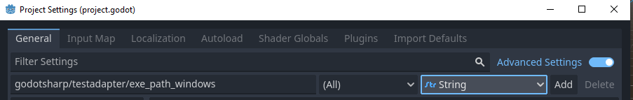
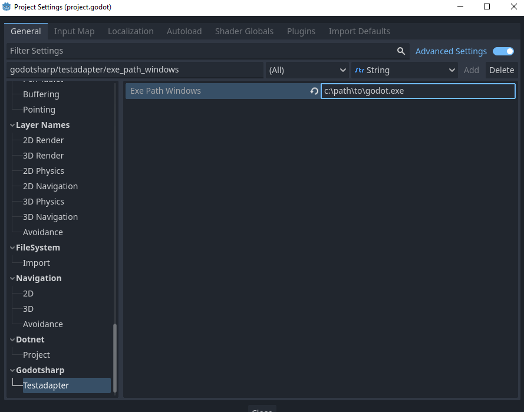

# GodotSharp.TestAdapter

An experimental .NET Test Adapter for the Godot 4 game engine.

- [GodotSharp.TestAdapter](#godotsharptestadapter)
- [Features](#features)
	- [Main Features](#main-features)
	- [Visual Studio Code Integration](#visual-studio-code-integration)
	- [Jetbrains Rider Integration](#jetbrains-rider-integration)
	- [Visual Studio 2022 Integration](#visual-studio-2022-integration)
	- [Godot Editor Integration](#godot-editor-integration)
- [Installation](#installation)
	- [Install Nuget Packages and Project References](#install-nuget-packages-and-project-references)
	- [Install Godot Addon](#install-godot-addon)
	- [Configure Godot Project](#configure-godot-project)
	- [Configure Visual Studio Code](#configure-visual-studio-code)
	- [Configure JetBrains Rider](#configure-jetbrains-rider)
	- [Configure Visual Studio](#configure-visual-studio)
	- [Configure Godot Editor](#configure-godot-editor)
- [Resources](#resources)
- [Known Issues and Workarounds](#known-issues-and-workarounds)
	- [Unable to debug tests from vscode test explorer](#unable-to-debug-tests-from-vscode-test-explorer)


# Features

`NOTE:` The .NET ecosystem has a complicated history in regards to testing frameworks and tooling, making research and development of a universal test adapter/runner difficult. Documentation is sparse or buried in prior implementations. Below is a listing of known features and IDE integrations, and their status:

✅Seems to work ❌Does not work ❓Untested 🚧Future

## Main Features

<table>
<tr>
	<th>Feature</th>
	<th>Windows</th>
	<th>Linux</th>
	<th>Macosx</th>
</tr>
<tr>
	<td>Run / Debug Tests In-Engine</td>
	<td>✅</td>
	<td>❓</td>
	<td>❓</td>
</tr>
<tr>
	<td>Single or mutli project layouts</td>
	<td>✅</td>
	<td>✅</td>
	<td>✅</td>
</tr>
<tr>
	<td>MSTest [TestClass] attribute</td>
	<td>✅</td>
	<td>✅</td>
	<td>✅</td>
</tr>
<tr>
	<td>MSTest [TestMethod] attribute</td>
	<td>✅</td>
	<td>✅</td>
	<td>✅</td>
</tr>
<tr>
	<td>MSTest [TestInitialize] attribute</td>
	<td>🚧</td>
	<td>🚧</td>
	<td>🚧</td>
</tr>
<tr>
	<td>MSTest [TestCleanup] attribute</td>
	<td>🚧</td>
	<td>🚧</td>
	<td>🚧</td>
</tr>
<tr>
	<td>MSTest [AssemblyInitialize] attribute</td>
	<td>🚧</td>
	<td>🚧</td>
	<td>🚧</td>
</tr>
<tr>
	<td>MSTest [AssemblyCleanup] attribute</td>
	<td>🚧</td>
	<td>🚧</td>
	<td>🚧</td>
</tr>
<tr>
	<td>MSTest [ClassInitialize] attribute</td>
	<td>🚧</td>
	<td>🚧</td>
	<td>🚧</td>
</tr>
<tr>
	<td>MSTest [ClassCleanup] attribute</td>
	<td>🚧</td>
	<td>🚧</td>
	<td>🚧</td>
</tr>
</table>

## Visual Studio Code Integration

<table>
<tbody>
<tr>
	<th>Feature</th>
	<th>Windows</th>
	<th>Linux</th>
	<th>Macosx</th>
</tr>
<tr>
	<td>Test Explorer -> Discover Tests
	<td>✅</td>	
	<td>❓</td>
	<td>❓</td>	
</tr>
<tr>
	<td>Test Explorer -> Run All
	<td>✅</td>
	<td>❓</td>
	<td>❓</td>
</tr>
<tr>
	<td>Test Explorer -> Debug All
	<td>❌</td>
	<td>❓</td>
	<td>❓</td>
</tr>
<tr>
	<td>Test Explorer -> Run Test
	<td>✅</td>	
	<td>❓</td>
	<td>❓</td>
</tr>
<tr>
	<td>Test Explorer -> Debug Test
	<td>❌</td>
	<td>❓</td>
	<td>❓</td>	
</tr>
<tr>
	<td>Test Explorer -> Go To Code
	<td>❌</td>
	<td>❓</td>
	<td>❓</td>	
</tr>
<tr>
	<td>Code Editor -> Run Test
	<td>✅</td>
	<td>❓</td>
	<td>❓</td>	
</tr>
<tr>
	<td>Code Editor -> Debug Test
	<td>✅</td>
	<td>❓</td>
	<td>❓</td>	
</tr>
<tbody>
</table>

## Jetbrains Rider Integration

<table>
<tbody>
<tr>
	<th>Feature</th>
	<th>Windows</th>	
	<th>Linux</th>	
	<th>Macosx</th>
</tr>
<tr>
	<td>Test Explorer -> Discover Tests	
	<td>✅</td>
	<td>❓</td>	
	<td>❓</td>	
</tr>
<tr>
	<td>Test Explorer -> Run All
	<td>✅</td>
	<td>❓</td>
	<td>❓</td>
</tr>
<tr>
	<td>Test Explorer -> Run Test
	<td>✅</td>
	<td>❓</td>	
	<td>❓</td>	
</tr>
<tr>
	<td>Test Explorer -> Debug Test
	<td>❌</td>	
	<td>❓</td>	
	<td>❓</td>	
</tr>
<tr>
	<td>Test Explorer -> Go To Code
	<td>✅</td>
	<td>❓</td>
	<td>❓</td>	
</tr>
<tr>
	<td>Code Editor -> Run Test
	<td>✅</td>
	<td>❓</td>
	<td>❓</td>	
</tr>
<tr>
	<td>Code Editor -> Debug Test
	<td>❌</td>
	<td>❓</td>
	<td>❓</td>	
</tr>
<tbody>
</table>

## Visual Studio 2022 Integration

<table>
<tbody>
<tr>
	<th>Feature</th>
	<th>Windows</th>	
	<th>Macosx</th>
</tr>
<tr>
	<td>Test Explorer -> Discover Tests	
	<td>❌</td>	
	<td>❓</td>	
</tr>
<tr>
	<td>Test Explorer -> Run All
	<td>❌</td>
	<td>❓</td>	
</tr>
<tr>
	<td>Test Explorer -> Debug All
	<td>❌</td>
	<td>❓</td>	
</tr>
<tr>
	<td>Test Explorer -> Run Test
	<td>❌</td>	
	<td>❓</td>	
</tr>
<tr>
	<td>Test Explorer -> Debug Test
	<td>❌</td>	
	<td>❓</td>	
</tr>
<tr>
	<td>Test Explorer -> Go To Code
	<td>❌</td>
	<td>❓</td>	
</tr>
<tr>
	<td>Code Editor -> Run Test
	<td>❌</td>
	<td>❓</td>	
</tr>
<tr>
	<td>Code Editor -> Debug Test
	<td>❌</td>
	<td>❓</td>	
</tr>
<tbody>
</table>

## Godot Editor Integration

<table>
<tbody>
<tr>
	<th>Feature</th>
	<th>Windows</th>	
	<th>Linux</th>	
	<th>Macosx</th>
</tr>
<tr>
	<td>Test Explorer -> Discover Tests	
	<td>🚧</td>
	<td>🚧</td>
	<td>🚧</td>
</tr>
<tr>
	<td>Test Explorer -> Run All
	<td>🚧</td>
	<td>🚧</td>
	<td>🚧</td>
</tr>
<tr>
	<td>Test Explorer -> Debug All
	<td>🚧</td>
	<td>🚧</td>
	<td>🚧</td>
</tr>
<tr>
	<td>Test Explorer -> Run Test
	<td>🚧</td>
	<td>🚧</td>
	<td>🚧</td>
</tr>
<tr>
	<td>Test Explorer -> Debug Test
	<td>🚧</td>
	<td>🚧</td>
	<td>🚧</td>
</tr>
<tr>
	<td>Test Explorer -> Go To Code
	<td>🚧</td>
	<td>🚧</td>
	<td>🚧</td>
</tr>
<tbody>
</table>

# Installation

## Install Nuget Packages and Project References

Add the following `framework reference` to your `csproj`:

`<FrameworkReference Include="Microsoft.AspNetCore.App" />`

Add the following `nuget` packages to your `csproj` (you may keep these up to date with recent versions)

```
dotnet add package Microsoft.NET.Test.Sdk
dotnet add package MSTest.TestFramework
dotnet add package GodotSharp.TestAdapter
```

`IF:` you are using a multi project layout, you must also install the above nuget references in addition to adding those other projects as references to the main godot project (so the test proxy can find your assemblies)

` <ProjectReference Include="..\MyOtherProject\MyOtherProject.csproj" />`

## Install Godot Addon

Download a recent copy of the `GodotSharp.TestAdapter` addon archive from the releases page https://github.com/awesolabs/godotsharp-testadapter/releases

Extract the `GodotSharp.TestAdapter` folder from the archive to your `addons/` folder. The final path should be `addons/GodotSharp.TestAdapter`

## Configure Godot Project

Open your project with the Godot Editor

Navigate `Project -> Project Settings`

Toggle `advanced settings`

Add the godot executable path setting for your respective platform. The setting will expand environment variables so your project configuration is portable across environments.

| Platform | Setting Name                            | Example Path           | Example Env Var |
| -------- | --------------------------------------- | ---------------------- | --------------- |
| Windows  | godotsharp/testadapter/exe_path_windows | `c:\path\to\godot.exe` | `%GODOT4%`      |
| Linux    | godotsharp/testadapter/exe_path_linux   | `/path/to/godot`       | `$GODOT4`       |
| Macosx   | godotsharp/testadapter/exe_path_macosx  | `/path/to/godot`       | `$GODOT4`       |

Example of setting the variable for windows:





## Configure Visual Studio Code

TBD

## Configure JetBrains Rider

TBD

## Configure Visual Studio

TBD

## Configure Godot Editor

TBD

# Resources

<table>
<tr>
	<th>Link</th>
	<th>Description</th>
</tr>
<tr>
	<td>https://github.com/microsoft/vstest</td>
	<td>Visual Studio Test Platform repo</td>
</tr>
<tr>
	<td>https://github.com/microsoft/testfx</td>
	<td>MSTest Adapter and Framework</td>
</tr>
<tr>
	<td>https://github.com/microsoft/vstest/blob/main/docs/RFCs/0004-Adapter-Extensibility.md#writing-an-adapter</td>
	<td>Some docs on writing adapters</td>
</tr>
<tr>
	<td>https://github.com/Samsung/netcoredbg</td>
	<td>Open Source .NET debugger with same CLI interface as vsdbg (useful for linux?)
</tr>
</table>

# Known Issues and Workarounds

## Unable to debug tests from vscode test explorer

When attempting to debug tests from the vscode test explorer, you may recieve error: `error : Could not resolve SDK "Godot.NET.Sdk". Exactly one of the probing messages below indicates why we could not resolve the SDK. Investigate and resolve that message to correctly specify the SDK.`

The cause of this is unknown. Instead prefer to run or debug tests directly from the `[Run Test]` or `[Debug Test]` code lens options inside the test source file. 